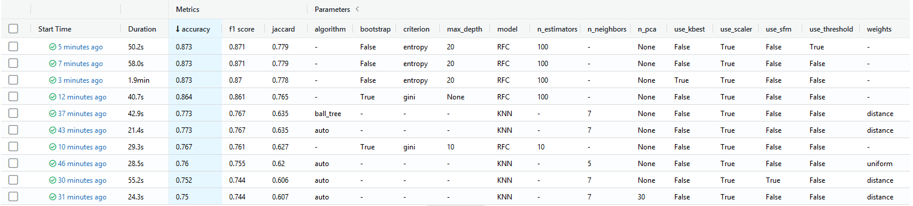
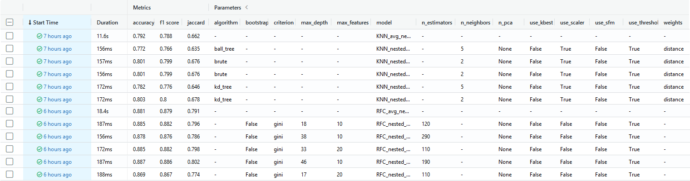
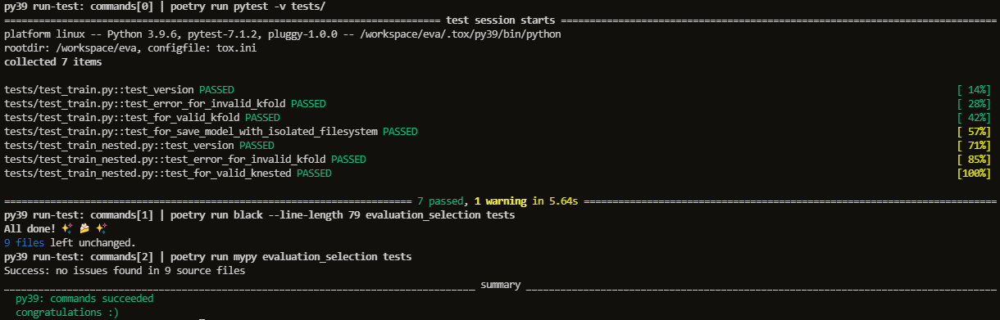

Create project with "poetry new" where have structure and config file pyproject.toml

Homework for RS School Machine Learning course.

This uses [Forest train](https://www.kaggle.com/competitions/forest-cover-type-prediction) dataset.

## Usage
This package allows you to train model for detecting the presence of heart disease in the patient.
1. Clone this repository to your machine.
2. Download [Forest train](https://www.kaggle.com/competitions/forest-cover-type-prediction) dataset, save csv locally (default path is *data/train.csv* in repository's root).
3. Make sure Python 3.9 and [Poetry](https://python-poetry.org/docs/) are installed on your machine (I use Poetry 1.1.13).
4. Install the project dependencies (*run this and following commands in a terminal, from the root of a cloned repository*):
```sh
poetry install --no-dev
```
5. Run train with the following command:
- KFold CV
```sh
poetry run train -d <path to csv with data> -s <path to save trained model>
```
default model KNeighborsClassifier 
for the model RandomForestClassifier
```sh
poetry run train -m rfc
```

- Nested CV
```sh
poetry run train_nested -d <path to csv with data> -s <path to save trained model>
```
default model KNeighborsClassifier 
for the model RandomForestClassifier
```sh
poetry run train_nested -m rfc
```

You can configure additional options (such as hyperparameters) in the CLI. To get a full list of them, use help:
```sh
poetry run train --help
poetry run train_nested --help
```
6. Run MLflow UI to see the information about experiments you conducted:
```sh
poetry run mlflow ui
```
- MLFlow after KFold CV


- MLFlow after Nested CV


## Development

The code in this repository must be tested, formatted with black, and pass mypy typechecking before being commited to the repository.

Install all requirements (including dev requirements) to poetry environment:
```
poetry install
```
Now you can use developer instruments, e.g. pytest:
```
poetry run pytest
```
More conveniently, to run all sessions of testing and formatting in a single command, install and use [tox](https://tox.wiki/en/latest/index.html): 
```
tox [-r]
```
- example with tox



Format your code with [black](https://github.com/psf/black) by using either tox or poetry:
```
tox -[r]s black
poetry run black evaluation_selection tests
```
Optional static typing with [mypy](http://mypy.readthedocs.io/en/latest/getting_started.html) by using either tox or poetry:
```
tox -[r]s mypy
poetry run mypy evaluation_selection tests
```

Linting with [Flake8](https://flake8.pycqa.org/en/latest/) by using either flake8 or tox or poetry:
```
flake8 evaluation_selection tests
```